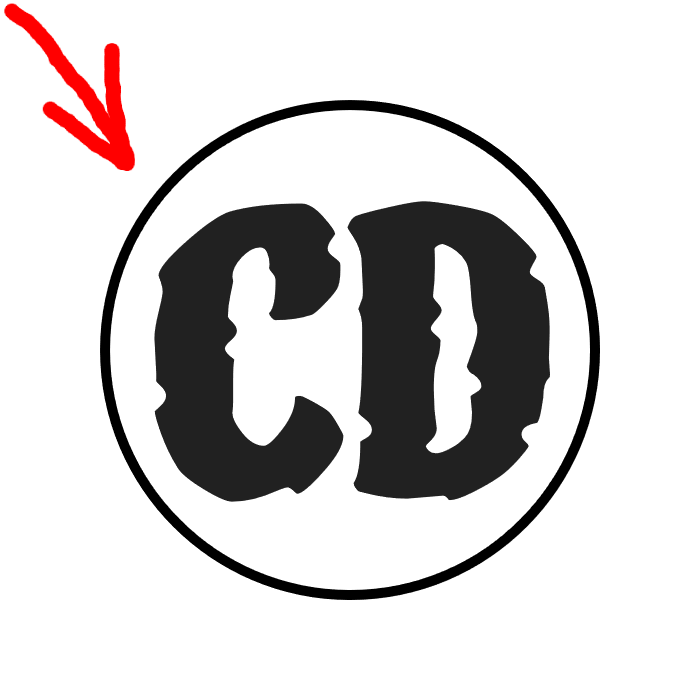
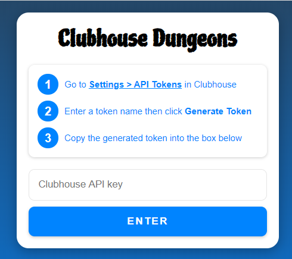
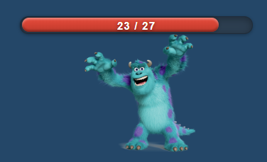
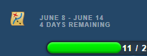
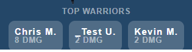
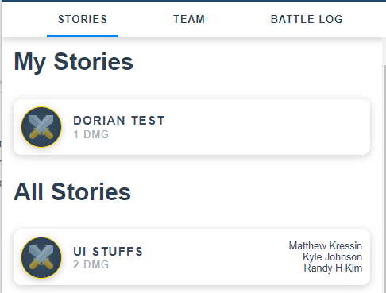
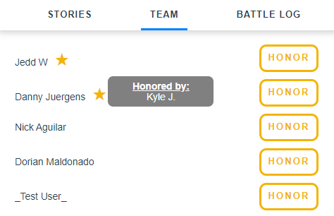
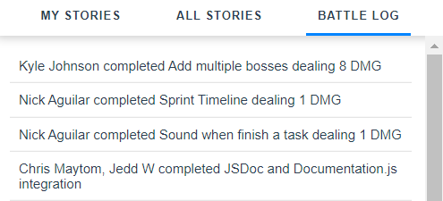
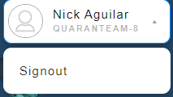

# Welcome to Clubhouse Dungeons! 

If you have not downloaded the extension yet, you can download it from [here](https://chrome.google.com/webstore/detail/quaranteam-8-chrome-exten/fkecccpikcmpaednaokcaajmdoimmpch)

To get started using Clubhouse Dungeons, first make sure you know your Clubhouse API token. If you do not have a Clubhouse API token, follow the steps below. 

## How to get your API Token
1.   Login to clubhouse.io with your account credentials
2.   In the top right click on the dropdown menu then click settings
3.   On the left, click on API Tokens
4.   Enter any name for your token and click generate token; then copy it to a safe place for login.

For more help refer to [Clubhouse API Token](https://help.clubhouse.io/hc/en-us/articles/205701199-Clubhouse-API-Tokens).

## Team Requirements
Your team will need to have the Clubhouse Iterations feature turned on. 
If you are starting a new clubhouse workspace, see the official Clubhouse documentation on what you need to know:
*   [How to Enable Iterations](https://help.clubhouse.io/hc/en-us/articles/360028913112-How-do-I-enable-Iterations-in-my-Workspace-)
*   [How to Create Iterations](https://help.clubhouse.io/hc/en-us/articles/360028926852-How-do-I-create-an-Iteration-)
*   [How to Add Stories to Iterations](https://help.clubhouse.io/hc/en-us/articles/360029262351-How-do-I-add-Stories-to-an-Iteration-)

## Setting Up Clubhouse Dungeons
To open Clubhouse Dungeons, find the icon  located in your Chrome extensions.
When you open Clubhouse Dungeons for the first time, or you sign out of Clubhouse Dungeons, you will see the login page.

If you have your Clubhouse API token ready, you can enter it into the text box where it says “Clubhouse API key” and press enter.

If nothing happens after clicking the “Enter” button, double-check to make sure that you have entered your API token correctly into the specified text field. If you are sure that you have entered your API token correctly and you are still unable to login, then there is a chance that your Clubhouse API token is invalid and you will need to create a new API token using the steps mentioned previously.

**Congratulations! You are now ready to take on your first Boss with the rest of your team! Good luck in your journey and welcome to Clubhouse Dungeons!**

## Overview of Features
### Monster and Healthbar
Here is the monster for this week’s iteration. Your team will need to complete all the stories for this week’s iteration in order to defeat the monster.

Every story completion will be an attack against the monster and chip away at the health bar. When every story in the iteration is complete, you beat the monster!

### Boss Map
On the top left you will find the boss map icon . Click the icon and you will be able to view the bosses you have beaten and the next bosses you will encounter in upcoming iterations. 

### Iteration Timeline
Keep track of your team's current iteration start and end dates to see when the next boss is ready to fight and when to beat the boss by!

### Top Warriors
Here you will find the top warriors on the team that have contributed the most to the battle. The damage seen is the total amount of points from the stories you have completed in this iteration. Finish your stories and aim to become a top warrior.

### Tabs
These tabs shown below allow you to change views between the Stories tab, Team tab, and the Battle Log tab.

#### Stories Tab
The stories tab will house all stories assigned to you in addition to the rest of the team’s stories toward. Here is where you will mark your story as completed and launch an attack against the monster.

#### Team Tab
Here is where you can see a list of your team members. You will be able to honor a team member by clicking on the honor button and you will be able to view who honored you by hovering over the star. You can only honor 3 team members per iteration so use these for outstanding members of the team! 

#### Battle Log Tab
Stay up to date with your team's battle. The Battle Log shows who has completed stories, and how much damage they have done to the monster. 

## Signing Out
When you want to sign out, just click your name on the top right corner and click signout. You will be redirected to the login page.

